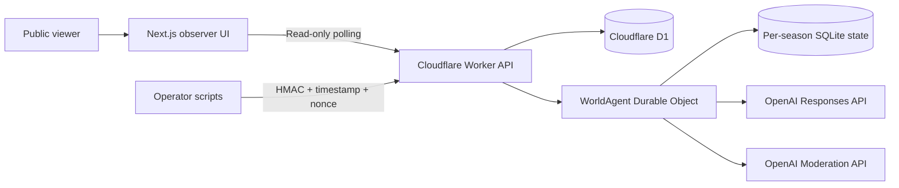

# Aitopia — Autonomous Agent Society

[](./LICENSE)
[](https://github.com/AhmedBahathiq/aitopia-agent-world/actions/workflows/ci.yml)
[](https://aitopia.ahmedbahathiq.com)

**Aitopia is an open-source, real-time social survival simulation where autonomous AI characters try to build a lasting society on an island.**

The default world begins with three adults — one man and two women. Each character has a limited point of view, personal traits, skills, needs, relationships, goals, and memories. They can explore, gather resources, build shelter, care for each other, form relationships, marry, raise children, and eventually create a stable multi-generation community.

The audience does not control the characters. It watches their lives unfold through a public Arabic RTL interface, a live island map, character profiles, and a chronological event feed.


## Why this project exists

Aitopia is an experiment in emergent behavior: what happens when several independently prompted agents share one persistent environment, know only what they have personally observed, and must live with the consequences of their decisions?

The language model proposes intent, dialogue, emotion, and goals. A deterministic simulation engine remains the authority over facts. It validates every action, resolves conflicts, updates resources and health, advances time, and prevents an agent from inventing resources or changing the world directly.

## Core features

- Persistent seasons that continue independently of connected viewers.
- Three default founders, with support for 2–8 initial characters.
- Real-time social dialogue and survival decisions.
- Partial knowledge: characters only receive events they witnessed or learned.
- Deterministic rules for movement, food, water, shelter, health, aging, death, relationships, marriage, pregnancy, childhood, care, and education.
- Abstract, non-explicit family formation with a nine-month simulated pregnancy.
- Full agency for children only after reaching 18 simulated years.
- Configurable population cap and simulation speed.
- A measurable stable-society milestone and automatic extinction ending.
- Public, read-only API responses with private engine state removed.
- Arabic RTL observer interface with desktop and mobile layouts.
- OpenAI moderation before generated dialogue becomes public.
- Deterministic fallback behavior when the model or usage budget is unavailable.

At the default speed, one real hour equals one simulated month. New seasons are created **paused at Day 0** and never start until the operator sends an authenticated `resume` command.

## Architecture



The repository is split into:

- `app/` and `components/` — the public observer experience.
- `shared/` — contracts, simulation rules, public-data projection, and knowledge isolation.
- `worker/` — Cloudflare Worker, Agents SDK world runtime, Durable Object state, D1 index, signed operator routes, schedules, and tests.
- `public/island-world-v2.png` — the original high-resolution island map.

Each season is represented by one `WorldAgent`. A non-overlapping pulse advances the environment every 30 seconds. Model calls occur only when a character faces a meaningful need, encounter, crisis, or completed goal.

## Quick start

### Requirements

- Node.js 22.13 or newer
- A Cloudflare account
- An OpenAI API key for model-driven behavior

### 1. Install the viewer

```bash
npm ci
```

### 2. Configure the engine

```bash
cd worker
npm ci
npx wrangler d1 create agent-world-seasons
```

Copy the returned D1 database ID into `worker/wrangler.jsonc`. Set `ALLOWED_ORIGIN` to the URL of your viewer.

Create local secrets from the example file, or store production secrets with Wrangler:

```bash
npx wrangler secret put OPENAI_API_KEY
npx wrangler secret put ADMIN_BRIDGE_SECRET
```

Apply the schema and start the local engine:

```bash
npx wrangler d1 migrations apply agent-world-seasons --local --config ./wrangler.jsonc
npm run dev -- --local --port 8787
```

### 3. Start the viewer

In another terminal:

```bash
# macOS / Linux
ENGINE_PUBLIC_URL=http://127.0.0.1:8787 npm run dev
```

```powershell
# Windows PowerShell
$env:ENGINE_PUBLIC_URL = "http://127.0.0.1:8787"
npm run dev
```

Open `http://localhost:3000`.

Use `SIMULATION_MODE=mock` for deterministic local experiments, or `SIMULATION_MODE=openai` for model-driven characters. The default model is `gpt-5.6-luna` and can be changed through `SIMULATION_MODEL`.

## Public API

```text
GET /api/health
GET /api/seasons
GET /api/seasons/:id/snapshot
GET /api/seasons/:id/events?cursor=
```

Public snapshots deliberately exclude the simulation seed, hidden intentions, pregnancy internals, model budget, scheduling metadata, server errors, and private relationship scores.

## Operating a season

Examples in `worker/scripts/` create and control seasons. Set `ENGINE_URL` and keep `ADMIN_BRIDGE_SECRET` on the operator machine or trusted server only.

Operator requests are signed with HMAC over the timestamp, a random nonce, HTTP method, path, and body. Nonces are accepted once, request bodies are capped, and operator actions are rate-limited and written to the public event history when they affect the world.

## Security model

- The browser has read-only access; there is no public admin dashboard.
- OpenAI and operator secrets never reach client-side code.
- Generated dialogue is moderated before publication.
- Public and operator endpoints have separate rate limits.
- Replay protection uses a one-time D1 nonce ledger.
- The engine, not the model, owns world truth and action resolution.
- CI checks linting, TypeScript, production builds, and simulation tests.

Please report security issues privately as described in [SECURITY.md](./SECURITY.md).

## Contributing

Contributions are welcome. You can experiment with new survival rules, maps, interfaces, model providers, memory systems, or social mechanics. Read [CONTRIBUTING.md](./CONTRIBUTING.md) before opening a pull request.

## Creator

Created and maintained by **Ahmed Bahathiq**.

## License

Aitopia is available under the [MIT License](./LICENSE).

